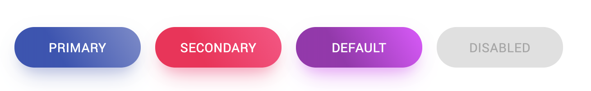

# Material Gradient Button

Material Gradient Button is a [Material-UI](https://material-ui.com/) based modern gradient colors button components.



## Install

```bash
npm i '@iktakahiro/material-gradient-button'

yarn add '@iktakahiro/material-gradient-button'
```

## Usage

```tsx
import { ContainedButton } from 'material-gradient-button'

const MyComponent = () => {
    return (
    <div>
        <ContainedButton color="primary">Primary</ContainedButton>
        <ContainedButton color="secondary">Secondary</ContainedButton>
        <ContainedButton>Default</ContainedButton>
        <ContainedButton color="primary" disabled={true}>Disabled</ContainedButton>
    </div>
    )
}
```
